# Automatone GUI concepts — v1

Twelve concept images: eleven pages, modes and dialogs, plus the controller item concept. Created with built-in ImageGen on 2026-09-06.

Visual direction: Minecraft-style square bevels, charcoal and stone panels, restrained copper accents, moss-green selections and pixel typography.

These images are art proposals for the later planning discussion. Sample settings, permissions, quantity behavior, relocation behavior and retirement rules remain illustrative until agreed in Plan mode. The controller sheet is a visual concept; its production sprite is still to be made. Generated text and item details may need refinement during implementation.

The exact generation prompts and the permissions cleanup prompt are saved in `prompts.json`. All twelve PNGs are included alongside this gallery.

## 01 · Workers

Ten slots in two rows of five, with each worker’s name, position, goal and status. The next free slot adds a worker.

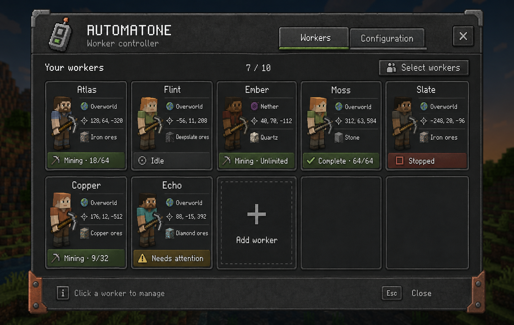

## 02 · Worker job

A dominant searchable block picker supports multiple targets and modded blocks, with quantity, start/stop, copy-job and relocation controls.

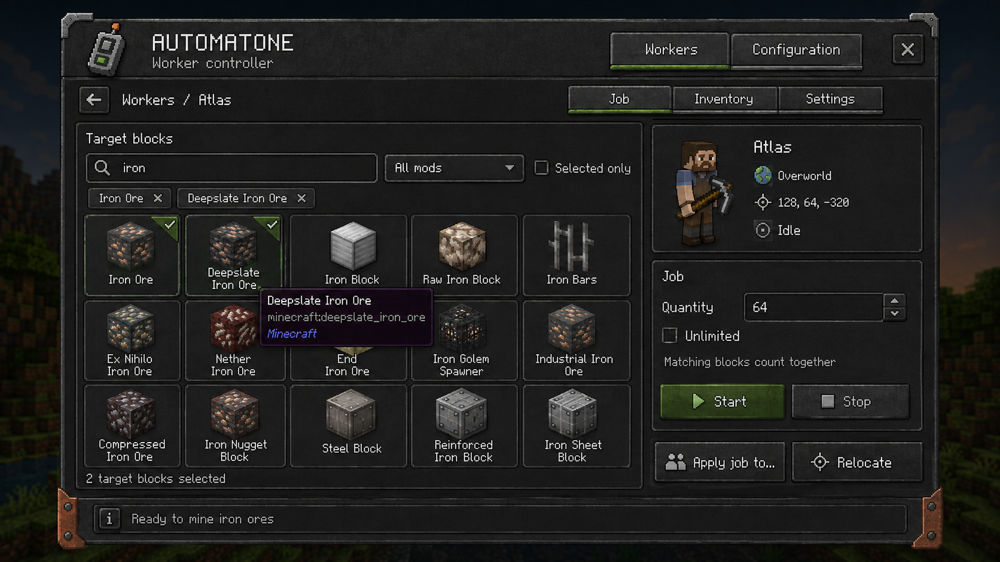

## 03 · Worker inventory

Nine worker slots, active tool selection, and the player inventory.

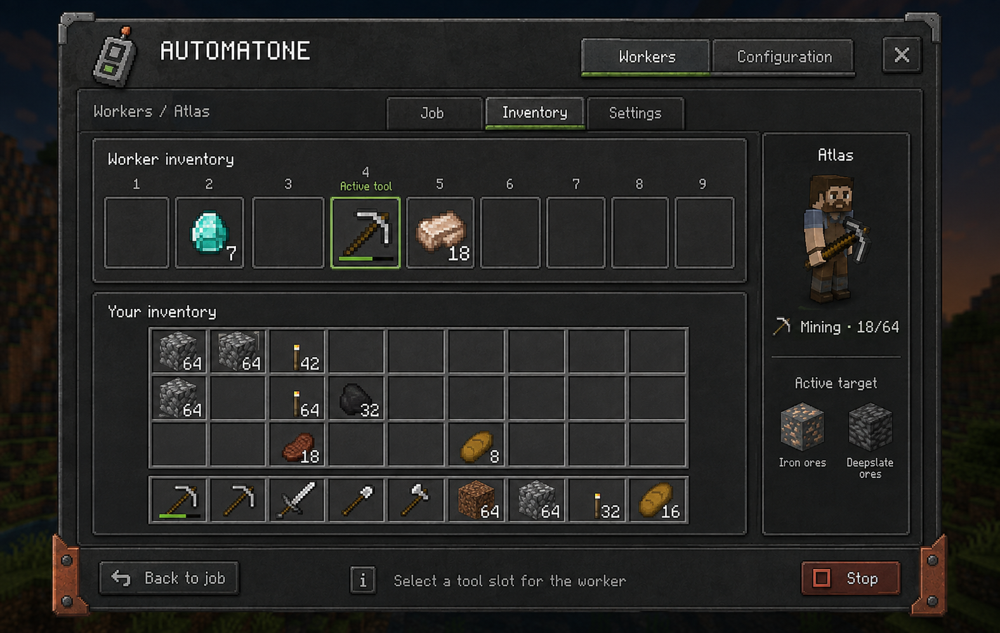

## 04 · Worker settings

Name, ownership, current location, relocation and retirement.

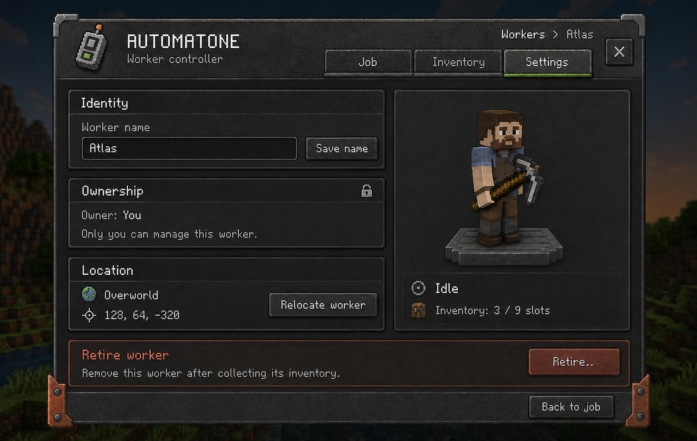

## 05 · Add worker

Choose Overworld or Nether deployment through random teleport.

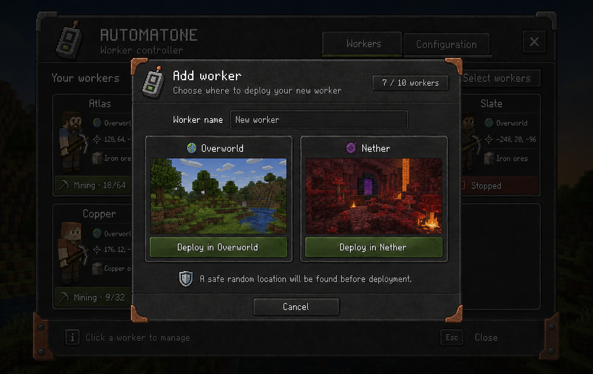

## 06 · Relocate worker

Choose a new dimension and review the proposed effect on the current job.

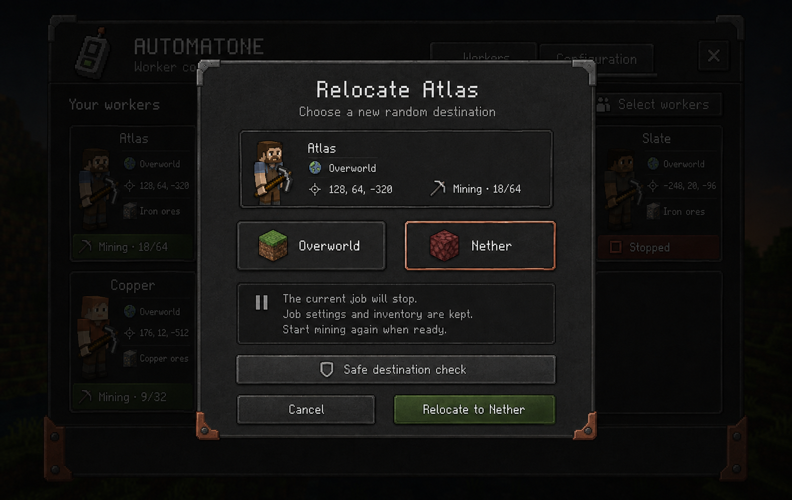

## 07 · Select workers

Roster selection mode with select-all and batch actions.

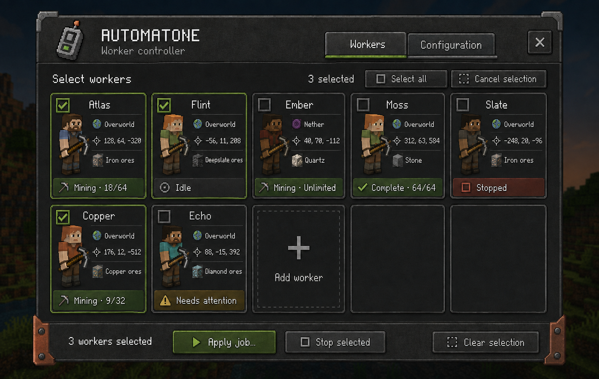

## 08 · Apply an existing job

Choose a source worker’s job, review recipients, then apply settings or apply and start.

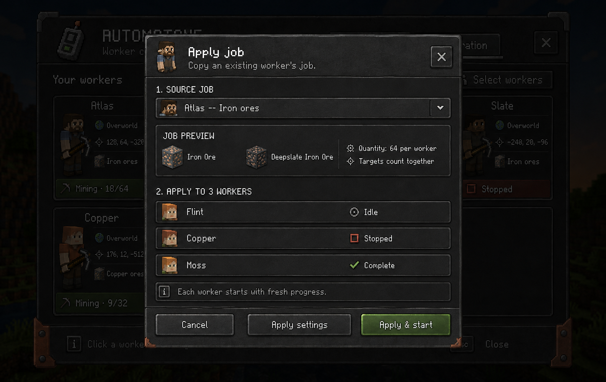

## 09 · Global configuration

Searchable native settings, categories, typed controls and change tracking.

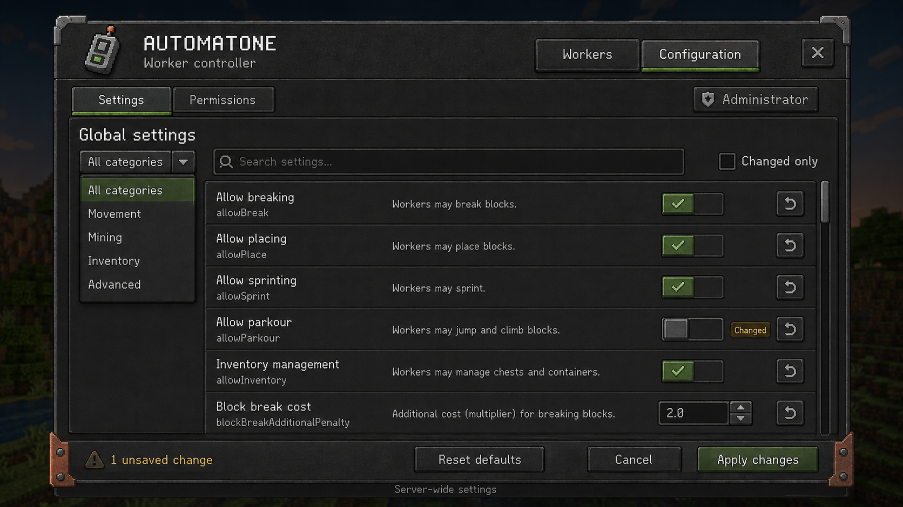

## 10 · Permissions

Role and ownership scope, plus access to individual global settings.

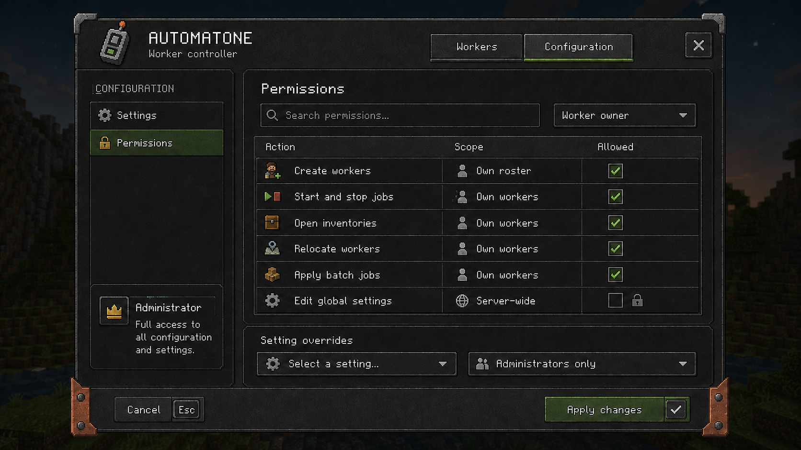

## 11 · Retire worker

A confirmation with inventory status and an explicit keep/remove choice.

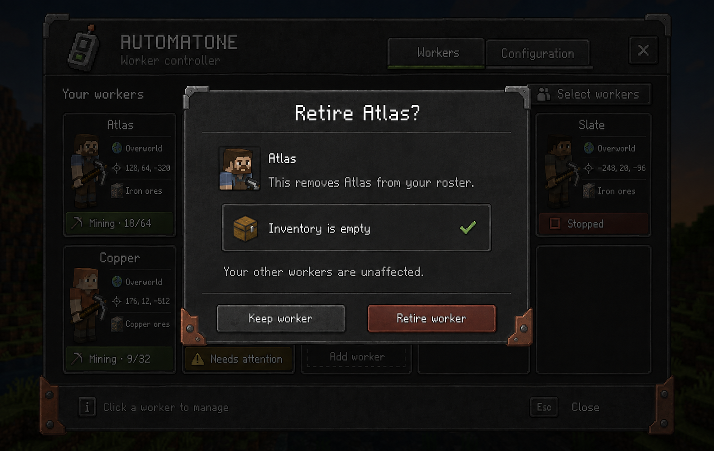

## 12 · Controller item

One custom controller design shown enlarged, in an inventory slot and in hand.

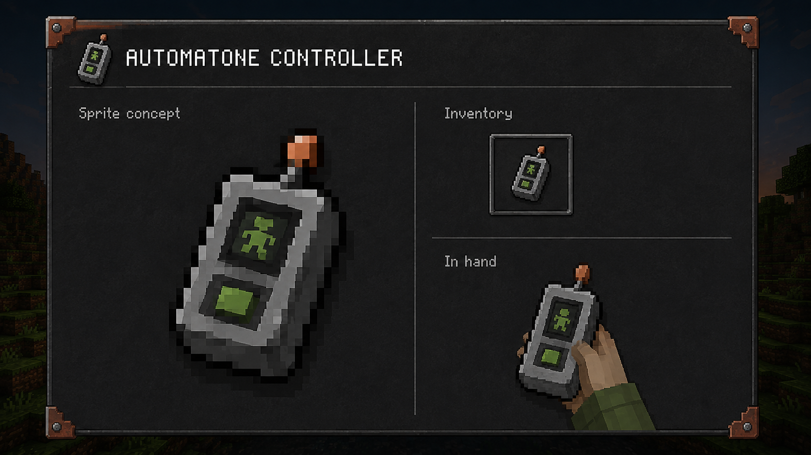

